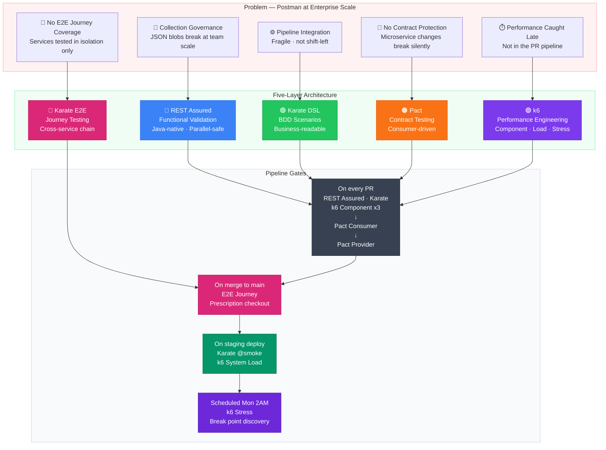
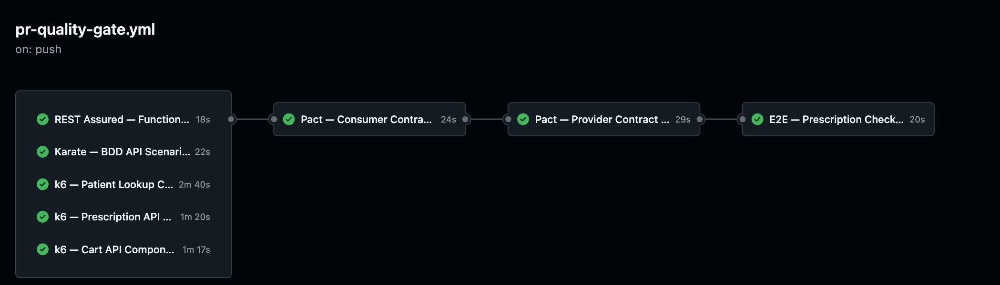

# API Quality Platform — Reference Architecture

**Context:** Walgreens Digital · Java/Kubernetes microservices · Azure · GitHub Actions

---

## 1. The Problem This Solves

Postman works at the squad level. It breaks at the platform level. Three specific failure modes:

**Collection governance collapses under distributed ownership.**
When 40 engineers across 12 squads own Postman collections, there is no source-of-truth. Collections live in individual accounts and the collection file itself is an opaque JSON blob — a diff in a pull request reveals nothing about what the test actually asserts. Environments duplicate with subtle drift. There is no enforceable naming or assertion standard across squads, and no review gate before a test change ships. The result: flaky CI, shadow environments, and no audit trail.

**Pipeline consistency does not scale with squad count.**
Newman is simple for one collection. Add 12 squads, 3 environments, and a per-endpoint test strategy, and the CI wiring multiplies across squads × environments × collections. Each team solves the same pipeline integration problem differently; the aggregate is brittle and every new squad inherits the divergence. A single reactor entrypoint — `mvn test` — that runs every layer the same way on every PR is the operating model answer to this.

**Environment variable management is not secrets management.**
Postman environments store credentials as plaintext exported JSON, committed to repos by accident, rotated by nobody, and scoped incorrectly across dev/staging/prod. The JSON-per-environment model has no schema, no fail-fast on missing values, so pipelines break silently when files drift between teams. In a regulated healthcare environment — HIPAA, PCI for pharmacy payments — this is not a configuration problem, it is a compliance problem.

**Beyond Postman's failure modes — two concerns Postman never attempted.**
A modern microservices platform needs contract protection between services and performance gates at PR time. Pact closes the schema-drift gap — a provider cannot rename a field without first breaking the verification build on every consumer that depends on it (Layer 3). k6 closes the performance-regression gap — component SLAs are validated on every pull request, not in a staging incident three sprints later (Layer 4). These are additions to the platform, not replacements for what Postman did.

---

## 2. Architecture Decision



Five testing layers across a Maven multi-module reactor. REST Assured and Karate replace Postman's role for functional validation, with code-reviewable artifacts under version control. Pact and k6 add concerns Postman never attempted — contract protection between services, and performance gates at PR time. Karate E2E adds the cross-service journey gate that confirms the integrated system behaves correctly as a whole. Each layer operates at a different abstraction level and runs at a different pipeline stage.

```
┌─────────────────────────────────────────────────────────┐
│  Layer 5: Karate E2E (Journey Testing)                  │
│  Problem solved: Confirms integrated system behavior    │
│  When: Merge to main + staging deploy                   │
├─────────────────────────────────────────────────────────┤
│  Layer 4: k6 (Performance Engineering)                  │
│  Problem solved: Performance caught too late            │
│  When: PR gate (component) + staging (system load)      │
├─────────────────────────────────────────────────────────┤
│  Layer 3: Pact (Contract Testing)                       │
│  Problem solved: Silent schema drift between services   │
│  When: PR gate, before any merge to main                │
├─────────────────────────────────────────────────────────┤
│  Layer 2: Karate (BDD API Testing)                      │
│  Problem solved: Collection governance, team ownership  │
│  When: PR gate + post-deploy smoke on staging           │
├─────────────────────────────────────────────────────────┤
│  Layer 1: REST Assured (Functional Validation)          │
│  Problem solved: Deep response validation, auth flows   │
│  When: PR gate on service-specific test modules         │
└─────────────────────────────────────────────────────────┘
```

**Why Maven multi-module, not separate repos?**
Shared parent POM enforces version alignment across all three layers. One `mvn verify` runs the full suite. Dependency versions for Pact, REST Assured, and Karate are declared once. Engineers cannot accidentally run incompatible Pact consumer/provider versions.

**Why not just Karate for everything?**
Karate is optimized for readability and squad-level collaboration. It has no native Pact broker integration and its Java interop for complex auth flows (OAuth2 PKCE, mTLS) requires workarounds. REST Assured handles those flows natively. Each tool does what it is actually good at.

---

## 3. Layer 1: REST Assured — Functional Validation

**Solves:** Deep payload validation, authentication, and stateful flows that require Java logic.

REST Assured tests live in `rest-assured/src/test/java/`. All HTTP configuration (base URL, auth headers, timeouts) is centralized in `ApiConfig` — no hardcoded values in test classes. The `PatientApiClient` wraps raw REST Assured calls so test classes express *what* is being validated, not *how* to make an HTTP call.

Base URL is injected via system property at runtime:
```
-Dapi.base.url=https://jsonplaceholder.typicode.com
```

This property is set per-environment in GitHub Actions, never in code.

**Test scope:** `PrescriptionApiTest` — CRUD lifecycle, response schema, HTTP status codes.
`CartApiTest` — item addition, quantity updates, total calculation validation.

**Runner:** TestNG with Surefire. Tags (`@Test(groups="smoke")`) allow the pipeline to run smoke-only subsets post-deploy.

---

## 4. Layer 2: Karate — BDD API Testing

**Solves:** Collection governance and cross-team ownership without requiring Java expertise.

Karate `.feature` files are the governed artifact. They live in version control under `karate/src/test/resources/features/`, organized by service domain (`prescription/`, `cart/`). Pull request review gates on these files give QE leads visibility into every test change — something that is impossible with Postman collections stored in personal accounts.

`karate-config.js` handles environment switching. The `karate.env` system property selects the environment block at runtime. No credentials in `.feature` files. No credentials in `karate-config.js` — those values are resolved from environment variables injected by the pipeline.

**Why Karate over Cucumber+REST Assured?**
Karate ships its own HTTP client. No glue code, no step definition maintenance. A QA engineer who cannot write Java can own a feature file end-to-end. Parallel execution is built in.

**Runner:** `KarateRunner.java` — a JUnit 5 `@Karate.Test` entry point. Surefire picks it up in the Maven lifecycle.

---

## 5. Layer 3: Pact — Contract Testing

**Solves:** Silent schema drift between microservices.

Pact inverts the testing direction. The consumer team (e.g., Cart service consuming Patient API) defines the contract — the minimum response shape they depend on — in a consumer test. That contract is published to a Pact Broker. The provider team (Patient service) runs provider verification against the published contracts before merging any schema change.

**The guarantee:** A Patient API team cannot merge a response field removal without first breaking the Pact verification build on every registered consumer. This surfaces contract violations at PR time, not in production.

`PrescriptionConsumerTest` — consumer side. Defines the interaction: *"when I call GET /patients/{id}, I expect these minimum fields."* Generates a pact JSON artifact.

`PatientProviderTest` — provider side. Replays the consumer-defined interaction against the running provider and verifies the response satisfies the contract.

**Pact Broker:** In production use, pact artifacts publish to a Pact Broker (self-hosted or PactFlow). The broker tracks which consumer versions are compatible with which provider versions — enabling `can-i-deploy` checks before any environment promotion.

**What contract testing prevents — concretely:** The Patient API team decides to rename the `name` field to `fullName` to align with a new data model. Without contract testing, they update their service, their unit tests pass, their Karate smoke scenarios pass (because those scenarios only check status codes and broad schema shape), and the PR merges. PrescriptionService — which reads `response.name` to print the patient label on a prescription — now receives `null` every time it fills a prescription. The failure shows up in production as a null pointer in the label-printing service, traced back to a field rename that happened three deploys ago. With contract testing: the Patient API team's PR runs `PatientProviderTest`, which replays PrescriptionService's published contract against the renamed response. The contract asserts `name` is a string. The verification fails. The PR is blocked. The conversation happens between two engineers before a single line ships to staging.

---

## 6. E2E Integration Testing

**Solves:** Confirming that all three microservices work correctly as an integrated system after a staging deployment.

The E2E journey test in `karate/src/test/resources/features/e2e/prescription-checkout-journey.feature` traverses the full prescription checkout flow in a single Karate scenario — patient lookup through checkout confirmation — chaining the output of each service call as the input to the next.

**The journey (four steps, three microservices, one scenario):**

| Step | Service | Call | Extracts |
|---|---|---|---|
| 1 | Patient Service | `GET /api/v1/patients/{patientId}/lookup` | `patientId`, `authToken` |
| 2 | Prescription Service | `GET /api/v1/prescriptions/active?patientId=…` | `prescriptionId` |
| 3 | Cart Service | `POST /api/v1/cart/add` | `cartId` |
| 4 | Cart Service | `POST /api/v1/checkout/submit` | `confirmationNumber` |

Each step asserts the previous service response before calling the next. If PatientService returns 404, the scenario fails at step 1 — it does not proceed to call PrescriptionService with invalid data.

**Why E2E runs on staging deploy, not on every PR:**
E2E tests the integrated system. PR tests validate individual service behavior. Blocking a PR on a staging-level journey test couples PR velocity to staging health — a false dependency that slows down the team for the wrong reason. Contract testing (Pact) catches interface violations at PR time. E2E confirms the integrated deployment behaves correctly as a whole.

**Tags:**
- `@e2e @smoke` — the happy path scenario (patient lookup through checkout confirmation)
- `@e2e @negative` — four failure scenarios, one per journey step

**Runner:** `EndToEndRunner.java` — JUnit 5, sequential (parallel=1), gated by `-Drun.e2e=true` to prevent accidental inclusion in the PR pipeline.

---

## 7. Pipeline Integration


*PR Quality Gate: Five parallel jobs — REST Assured, Karate BDD, and three k6 component performance gates run simultaneously, feeding Pact Consumer contract generation, followed by Pact Provider verification, and E2E prescription checkout journey on push to main. Total execution: ~4m on push to main.*

Three workflows, one principle: **the right tests at the right gate, at the right time.**

- **PR Quality Gate** — functional, BDD, and performance component gates on every pull request
- **Staging Smoke** — Karate @smoke + k6 system load on every staging deployment
- **Performance Stress** — scheduled Monday 2AM UTC, on-demand for capacity planning

### `pr-quality-gate.yml` — runs on every PR to `main`, and E2E on merge to `main`

```
On every PR:
1. REST Assured tests (service-scoped, fast — ~2 min)
2. Karate scenarios tagged @smoke (broad coverage, ~3 min)
3. Pact consumer tests → publish pacts to broker
4. Pact provider verification → verify published pacts

On merge to main only (not on PR):
5. E2E prescription checkout journey (EndToEndRunner, sequential)
```

The first four jobs must pass before a PR can merge. The E2E job (#5) runs only on push to main — after the merge — so it does not block the PR gate.

**Why Pact runs on PR, not post-deploy?**
Contract violations discovered post-deploy require a rollback or hotfix. Discovered on PR, they require a conversation between two teams. The cost difference is an order of magnitude.

**Why E2E runs on merge, not on PR?**
E2E tests the integrated system across all three microservices. Running it on every PR would couple PR velocity to staging environment health — a false dependency. Contract tests catch interface violations early. E2E confirms the integrated deployment is sound after the artifact is built.

### `staging-smoke.yml` — runs on deploy to staging

```
1. Karate scenarios tagged @smoke (base URL = staging endpoint)
2. E2E @smoke journey — prescription checkout across all three services
3. k6 system load — full prescription checkout journey under load
```

REST Assured and Pact do not re-run post-deploy. They validated against the artifact before it was promoted. Running them again against staging validates infrastructure, not code — that is an environment health check, not a quality gate.

**Environment variable strategy:** GitHub Actions secrets (`API_BASE_URL`, `AUTH_TOKEN`, `PACT_BROKER_URL`, `PACT_BROKER_TOKEN`) are injected as `-D` system properties at runtime. Zero secrets in code or config files.

---

## 8. What This Replaces and What It Doesn't

**Replaces:**
- Postman collections for regression and contract testing
- Newman as a CI runner
- Manual environment JSON management
- Tribal knowledge about which squad owns which API scenario

**Does not replace:**
- Exploratory testing with Postman (still the right tool for ad-hoc investigation)
- Performance testing (Gatling or k6 at a separate layer)
- UI-driven E2E flows (Playwright/Selenium for React frontend)
- Security scanning (OWASP ZAP, Checkmarx — separate pipeline stage)

The goal is not to eliminate Postman from engineers' desktops. The goal is to remove it from the CI pipeline where its governance model does not scale.

---

## Documentation

| Document | Purpose |
|---|---|
| [Architecture Decision](docs/architecture-decision.md) | Why each layer — trade-offs and alternatives considered |
| [Pipeline Design](docs/pipeline-design.md) | What runs when and why — the gate logic |
| [Current State — Postman](docs/CURRENT_STATE_POSTMAN.md) | Enterprise-scale limitations of Postman/Newman |
| [Test Pyramid](docs/TEST_PYRAMID.md) | Complete testing strategy including E2E and service virtualization |
| [Build Story](docs/BUILD_STORY.md) | How this was built — AI-native productivity model |
| [E2E Journey Feature](karate/src/test/resources/features/e2e/prescription-checkout-journey.feature) | Full prescription checkout journey — patient lookup through checkout across all three microservices |

---

## Use This Skill

This repository was built using a reusable Claude Code skill. The full prompt template — including all seven prompts, verification checklist, customization guide, and talking points — is available at:

👉 [SKILL.md](SKILL.md)

**Adapt it for any Java microservices project** by replacing six variables:
- PROJECT_NAME, PACKAGE_BASE, CONSUMER_NAME, PROVIDER_NAME, TARGET_API, DOMAIN

The skill produces a working three-layer API testing platform with GitHub Actions pipeline in under 9 hours using Claude Code.

---

## 9. Getting Started

**Prerequisites:** Java 17, Maven 3.9+

```bash
# Clone and verify the build compiles clean
git clone <repo>
cd api-quality-platform-reference
mvn clean compile -DskipTests

# Run all tests against JSONPlaceholder (public, no auth required)
mvn verify -Dapi.base.url=https://jsonplaceholder.typicode.com

# Run only smoke-tagged Karate scenarios
mvn verify -pl karate -Dkarate.options="--tags @smoke" -Dapi.base.url=https://jsonplaceholder.typicode.com

# Run Pact consumer tests and generate pact artifacts
mvn verify -pl pact -Dapi.base.url=https://jsonplaceholder.typicode.com

# Simulate what the PR gate runs
mvn verify -Dapi.base.url=https://jsonplaceholder.typicode.com \
           -Dpact.broker.url=${PACT_BROKER_URL} \
           -Dpact.broker.token=${PACT_BROKER_TOKEN}
```

**Module layout:** Each of the three modules under `rest-assured/`, `karate/`, and `pact/` is independently buildable. The root POM orchestrates them in dependency order.
