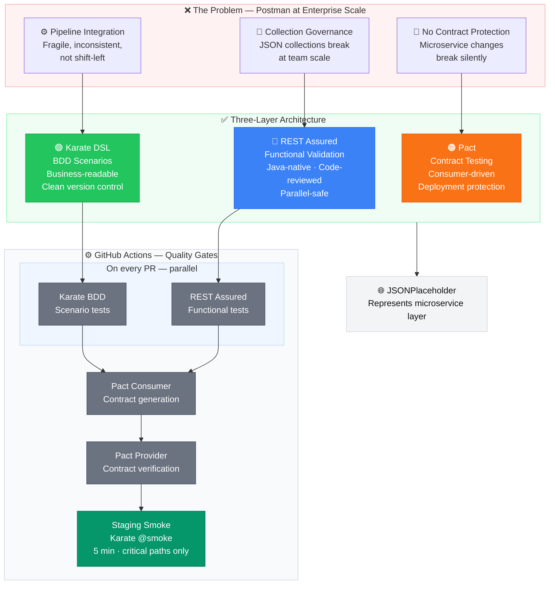

# API Quality Platform — Reference Architecture

**Context:** Walgreens Digital · Java/Kubernetes microservices · Azure · GitHub Actions

---

## 1. The Problem This Solves

Postman works at the squad level. It breaks at the platform level. Three specific failure modes:

**Collection governance collapses under distributed ownership.**
When 40 engineers across 12 squads own Postman collections, there is no source-of-truth. Collections live in individual accounts, environments get duplicated with subtle drift, and there is no review gate before a test change ships. The result: flaky CI, shadow environments, and no audit trail.

**Environment variable management is not secrets management.**
Postman environments store credentials as plaintext exported JSON, committed to repos by accident, rotated by nobody, and scoped incorrectly across dev/staging/prod. In a regulated healthcare environment — HIPAA, PCI for pharmacy payments — this is not a configuration problem, it is a compliance problem.

**Newman has no contract awareness.**
Postman/Newman validates HTTP responses against hand-maintained expected payloads. It has no mechanism to detect when a provider team changes a response schema and breaks every downstream consumer simultaneously. In a microservices mesh (Patient, Prescription, Cart, Inventory, Notification services), this class of regression is invisible until production.

---

## 2. Architecture Decision



Three testing layers, each solving exactly one of the three problems above. They are not redundant — they operate at different abstraction levels and run at different pipeline stages.

```
┌─────────────────────────────────────────────────────────┐
│  Layer 3: Pact (Contract Testing)                       │
│  Problem solved: Silent schema drift between services   │
│  When: PR gate, before any merge to main                │
├─────────────────────────────────────────────────────────┤
│  Layer 2: Karate (BDD API Testing)                      │
│  Problem solved: Collection governance, team ownership  │
│  When: PR gate + post-deploy smoke on staging           │
├─────────────────────────────────────────────────────────┤
│  Layer 1: REST Assured (Functional Validation)          │
│  Problem solved: Deep response validation, auth flows   │
│  When: PR gate on service-specific test modules         │
└─────────────────────────────────────────────────────────┘
```

**Why Maven multi-module, not separate repos?**
Shared parent POM enforces version alignment across all three layers. One `mvn verify` runs the full suite. Dependency versions for Pact, REST Assured, and Karate are declared once. Engineers cannot accidentally run incompatible Pact consumer/provider versions.

**Why not just Karate for everything?**
Karate is optimized for readability and squad-level collaboration. It has no native Pact broker integration and its Java interop for complex auth flows (OAuth2 PKCE, mTLS) requires workarounds. REST Assured handles those flows natively. Each tool does what it is actually good at.

---

## 3. Layer 1: REST Assured — Functional Validation

**Solves:** Deep payload validation, authentication, and stateful flows that require Java logic.

REST Assured tests live in `rest-assured/src/test/java/`. All HTTP configuration (base URL, auth headers, timeouts) is centralized in `ApiConfig` — no hardcoded values in test classes. The `PatientApiClient` wraps raw REST Assured calls so test classes express *what* is being validated, not *how* to make an HTTP call.

Base URL is injected via system property at runtime:
```
-Dapi.base.url=https://jsonplaceholder.typicode.com
```

This property is set per-environment in GitHub Actions, never in code.

**Test scope:** `PrescriptionApiTest` — CRUD lifecycle, response schema, HTTP status codes.
`CartApiTest` — item addition, quantity updates, total calculation validation.

**Runner:** TestNG with Surefire. Tags (`@Test(groups="smoke")`) allow the pipeline to run smoke-only subsets post-deploy.

---

## 4. Layer 2: Karate — BDD API Testing

**Solves:** Collection governance and cross-team ownership without requiring Java expertise.

Karate `.feature` files are the governed artifact. They live in version control under `karate/src/test/resources/features/`, organized by service domain (`prescription/`, `cart/`). Pull request review gates on these files give QE leads visibility into every test change — something that is impossible with Postman collections stored in personal accounts.

`karate-config.js` handles environment switching. The `karate.env` system property selects the environment block at runtime. No credentials in `.feature` files. No credentials in `karate-config.js` — those values are resolved from environment variables injected by the pipeline.

**Why Karate over Cucumber+REST Assured?**
Karate ships its own HTTP client. No glue code, no step definition maintenance. A QA engineer who cannot write Java can own a feature file end-to-end. Parallel execution is built in.

**Runner:** `KarateRunner.java` — a JUnit 5 `@Karate.Test` entry point. Surefire picks it up in the Maven lifecycle.

---

## 5. Layer 3: Pact — Contract Testing

**Solves:** Silent schema drift between microservices.

Pact inverts the testing direction. The consumer team (e.g., Cart service consuming Patient API) defines the contract — the minimum response shape they depend on — in a consumer test. That contract is published to a Pact Broker. The provider team (Patient service) runs provider verification against the published contracts before merging any schema change.

**The guarantee:** A Patient API team cannot merge a response field removal without first breaking the Pact verification build on every registered consumer. This surfaces contract violations at PR time, not in production.

`PrescriptionConsumerTest` — consumer side. Defines the interaction: *"when I call GET /patients/{id}, I expect these minimum fields."* Generates a pact JSON artifact.

`PatientProviderTest` — provider side. Replays the consumer-defined interaction against the running provider and verifies the response satisfies the contract.

**Pact Broker:** In production use, pact artifacts publish to a Pact Broker (self-hosted or PactFlow). The broker tracks which consumer versions are compatible with which provider versions — enabling `can-i-deploy` checks before any environment promotion.

**What contract testing prevents — concretely:** The Patient API team decides to rename the `name` field to `fullName` to align with a new data model. Without contract testing, they update their service, their unit tests pass, their Karate smoke scenarios pass (because those scenarios only check status codes and broad schema shape), and the PR merges. PrescriptionService — which reads `response.name` to print the patient label on a prescription — now receives `null` every time it fills a prescription. The failure shows up in production as a null pointer in the label-printing service, traced back to a field rename that happened three deploys ago. With contract testing: the Patient API team's PR runs `PatientProviderTest`, which replays PrescriptionService's published contract against the renamed response. The contract asserts `name` is a string. The verification fails. The PR is blocked. The conversation happens between two engineers before a single line ships to staging.

---

## 6. Pipeline Integration

Two workflows, one principle: **the right tests at the right gate.**

### `pr-quality-gate.yml` — runs on every PR to `main`

```
1. REST Assured tests (service-scoped, fast — ~2 min)
2. Karate scenarios tagged @smoke (broad coverage, ~3 min)
3. Pact consumer tests → publish pacts to broker
4. Pact provider verification → verify published pacts
```

All four must pass. PR cannot merge if any fail. This is the primary regression gate.

**Why Pact runs on PR, not post-deploy?**
Contract violations discovered post-deploy require a rollback or hotfix. Discovered on PR, they require a conversation between two teams. The cost difference is an order of magnitude.

### `staging-smoke.yml` — runs on deploy to staging

```
1. Karate scenarios tagged @smoke (base URL = staging endpoint)
2. Alerting on failure via PagerDuty webhook
```

REST Assured and Pact do not re-run post-deploy. They validated against the artifact before it was promoted. Running them again against staging validates infrastructure, not code — that is an environment health check, not a quality gate.

**Environment variable strategy:** GitHub Actions secrets (`API_BASE_URL`, `AUTH_TOKEN`, `PACT_BROKER_URL`, `PACT_BROKER_TOKEN`) are injected as `-D` system properties at runtime. Zero secrets in code or config files.

---

## 7. What This Replaces and What It Doesn't

**Replaces:**
- Postman collections for regression and contract testing
- Newman as a CI runner
- Manual environment JSON management
- Tribal knowledge about which squad owns which API scenario

**Does not replace:**
- Exploratory testing with Postman (still the right tool for ad-hoc investigation)
- Performance testing (Gatling or k6 at a separate layer)
- UI-driven E2E flows (Playwright/Selenium for React frontend)
- Security scanning (OWASP ZAP, Checkmarx — separate pipeline stage)

The goal is not to eliminate Postman from engineers' desktops. The goal is to remove it from the CI pipeline where its governance model does not scale.

---

## 8. Getting Started

**Prerequisites:** Java 17, Maven 3.9+

```bash
# Clone and verify the build compiles clean
git clone <repo>
cd api-quality-platform-reference
mvn clean compile -DskipTests

# Run all tests against JSONPlaceholder (public, no auth required)
mvn verify -Dapi.base.url=https://jsonplaceholder.typicode.com

# Run only smoke-tagged Karate scenarios
mvn verify -pl karate -Dkarate.options="--tags @smoke" -Dapi.base.url=https://jsonplaceholder.typicode.com

# Run Pact consumer tests and generate pact artifacts
mvn verify -pl pact -Dapi.base.url=https://jsonplaceholder.typicode.com

# Simulate what the PR gate runs
mvn verify -Dapi.base.url=https://jsonplaceholder.typicode.com \
           -Dpact.broker.url=${PACT_BROKER_URL} \
           -Dpact.broker.token=${PACT_BROKER_TOKEN}
```

**Module layout:** Each of the three modules under `rest-assured/`, `karate/`, and `pact/` is independently buildable. The root POM orchestrates them in dependency order.
